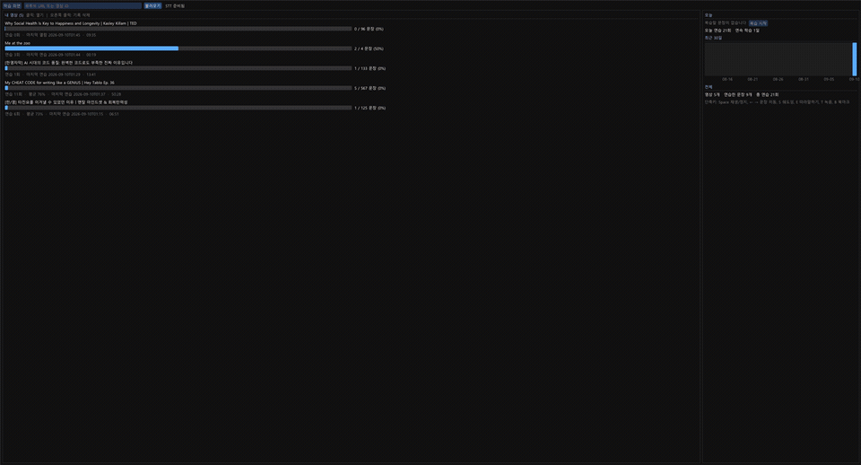
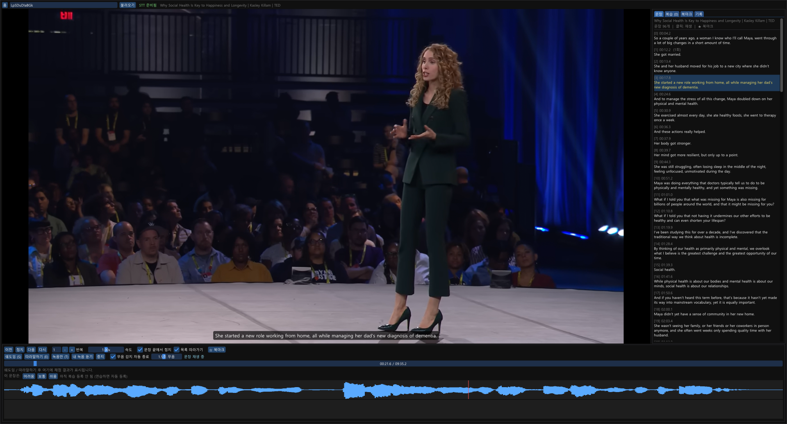
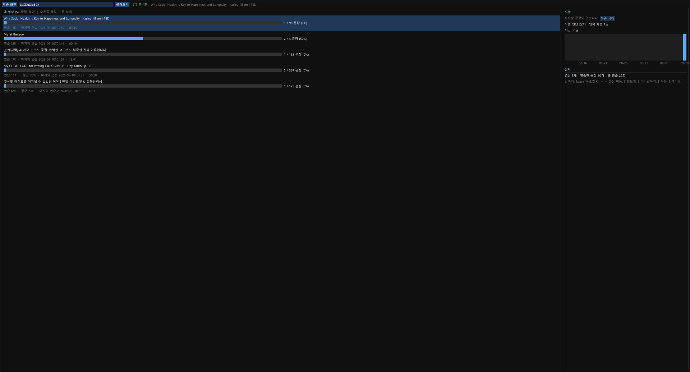
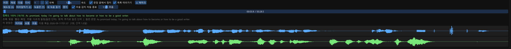
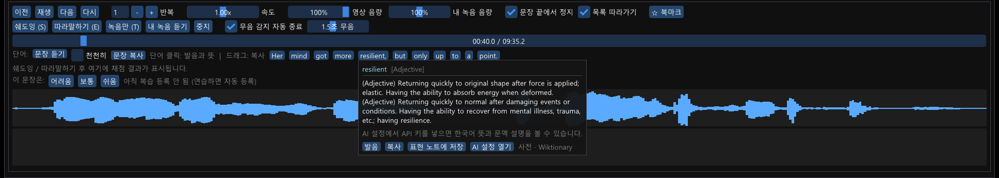

# YouShadow

[한국어](README.md) | **English**

A desktop app for practicing English shadowing with YouTube videos (C++, Windows / macOS).

Paste a link and it downloads the video with English subtitles, splits them into sentences, and lets you practice each one — loop playback, shadowing, and repeat-after-me recording — then grades your pronunciation with whisper speech recognition. Practice history is stored in SQLite, and a spaced-repetition scheduler picks which sentences to review.



## Screenshots

| Study screen | Home (library) |
|---|---|
|  |  |





## Features

- **Load a video**: YouTube URL → yt-dlp downloads a 720p video and English subtitles (json3). If there are no subtitles, or YouTube blocks the subtitle request, a transcript is generated with whisper.cpp
- **Sentence splitting**: word timestamps are split into sentences by punctuation, silence, and length
- **Playback**: video via libmpv. Click a sentence to play it, loop, 0.5x–1.5x speed (pitch preserved), current sentence highlighted during free playback
- **Practice modes**
  - Shadowing: speak along with the original (recording continues until you finish, even after the clip ends)
  - Repeat-after-me: listen → speak → hear the original and your recording back to back
  - Record only: record right away without hearing the original (for drilling the same sentence)
  - Auto-stop on silence (background noise is measured to auto-tune sensitivity), or press Space to stop manually
- **Scoring**: your recording is transcribed with whisper and aligned word by word against the original. Shows accuracy % with correct / missing / misheard / extra words. Fillers ("uh", "um") and sound-effect tags are ignored
- **Sentence drills** ([학습] tab)
  - Listening: hear a sentence with subtitles hidden and type what you heard. Scored word by word, ignoring case and punctuation
  - Composition: see only the Korean translation (from the AI explanation) and write the English sentence (the translation can be generated on the spot)
  - While a drill is in progress the answer is hidden everywhere — subtitles, sentence list, word buttons, explanations — and results feed into practice history and stats
- **AI expression explanations** (pick one of Claude / ChatGPT / Gemini, with your own API key)
  - For each sentence: Korean translation, expressions worth learning (meaning · nuance · example), and grammar points. Neighboring sentences are sent as context
  - Generate one sentence at a time or the whole video at once; results are cached in the DB
  - Save an expression you like → it goes to the expression notebook and comes back as a flashcard in review sessions (front: expression → reveal meaning → grade)
  - API keys are encrypted so only your account on this PC can read them (Windows: DPAPI, macOS: Keychain)
- **History and review** (SQLite)
  - Home: per-video progress, practice counts, average score, last practiced, a 30-day chart, and study streak
  - Per-sentence practice history with playback of old recordings, and bookmarks
  - Spaced repetition: practiced sentences appear in the review list the next day; grading them hard / good / easy schedules the next review (simplified SM-2)
  - Review sessions: one click on [복습 시작] walks you through everything that is due
- **Waveforms**: the original sentence and your recording side by side
- **Volume**: separate video and recording-playback volume (remembered)
- **Word pronunciation and meaning**: the current sentence expands into word buttons; click one and the system speech synthesizer (an English voice) pronounces it while a meaning popup opens. With an AI key you get the base form, IPA, part of speech, Korean meaning, how it is used in this sentence, and an example; without one, English definitions from Wiktionary. Save straight to the expression notes from the popup. Also whole-sentence and slow playback, plus [듣기] buttons in the expressions tab and review cards. Pronunciation is offline, nothing to install
- **Copy sentences**: drag across the word buttons to copy that range to the clipboard, or use [문장 복사] to copy the whole sentence

## Download (for users)

Get it from [Releases](https://github.com/JuZeroKR/YouShadow/releases).

| File | Description |
|---|---|
| `YouShadow-Setup-v*.exe` | Windows 10/11 64-bit installer. Installs into the user folder without admin rights and registers a Start Menu entry |
| `YouShadow-v*-win64.zip` | Windows portable. Unzip and run `YouShadow.exe` |
| `YouShadow-v*-macos-arm64.zip` | macOS 12+ (Apple Silicon). Unzip and move `YouShadow.app` to Applications |

- yt-dlp, ffmpeg, and deno are bundled — nothing else to install.
- The whisper model (148MB), used for pronunciation scoring and for transcribing videos without subtitles, is downloaded with the [STT 모델 받기] button at the top of the app.
- Study data is stored in `%LOCALAPPDATA%\YouShadow` on Windows and `~/Library/Application Support/YouShadow` on macOS, and survives uninstalling.
- The binaries are not code-signed, so you may see a warning on first launch. On Windows: SmartScreen → More info → Run anyway. On macOS: right-click → Open (if that fails: `xattr -dr com.apple.quarantine /Applications/YouShadow.app`).

## Build (for developers)

### Windows

Requirements: Windows 10/11, Visual Studio 2022 or later (MSVC), CMake 3.20+, git

```powershell
# 1. Fetch dependencies (into third_party/ and models/, not committed)
powershell -ExecutionPolicy Bypass -File scripts\setup-deps.ps1

# 2. Build (uses the newest installed Visual Studio)
cmake -S . -B build -A x64
cmake --build build --config Release

# 3. External tools needed at runtime
winget install yt-dlp.yt-dlp     # puts yt-dlp + ffmpeg on PATH
```

### macOS

Requirements: macOS 12+, Xcode Command Line Tools, CMake 3.20+, git, [Homebrew](https://brew.sh)

```bash
# 1. Fetch dependencies (into third_party/ and models/, plus brew: glfw, mpv, yt-dlp, ffmpeg)
bash scripts/setup-deps.sh

# 2. Build
cmake -S . -B build -DCMAKE_BUILD_TYPE=Release
cmake --build build -j

# 3. Run (from the repo root)
./build/youshadow-gui
```

Platform-specific pieces: HTTPS is WinHTTP ↔ system libcurl, API-key encryption is DPAPI ↔ Keychain (master key) + AES-256, word pronunciation is SAPI ↔ AVSpeechSynthesizer, data lives in `%LOCALAPPDATA%\YouShadow` ↔ `~/Library/Application Support/YouShadow`. The first recording asks for microphone permission.

### Shared dependencies

What `scripts/setup-deps.ps1` (Windows) / `scripts/setup-deps.sh` (macOS) fetches:

| Library | Purpose |
|---|---|
| [Dear ImGui](https://github.com/ocornut/imgui) + [GLFW](https://www.glfw.org/) | GUI |
| [libmpv](https://mpv.io/) ([zhongfly/mpv-winbuild](https://github.com/zhongfly/mpv-winbuild)) | video playback (rendered into an OpenGL texture) |
| [whisper.cpp](https://github.com/ggml-org/whisper.cpp) + ggml-base.en model | speech recognition (scoring, transcripts) |
| [miniaudio](https://miniaud.io/) | microphone recording, playback |
| [SQLite](https://www.sqlite.org/) | study history |
| [nlohmann/json](https://github.com/nlohmann/json) | subtitle parsing |

### Making release packages

```powershell
powershell -ExecutionPolicy Bypass -File scripts\package.ps1   # Windows
```
```bash
brew install dylibbundler
bash scripts/package.sh                                        # macOS
```

Output goes to `dist/` — on Windows a portable zip and an Inno Setup installer, on macOS `YouShadow.app` and a zip (libmpv and other dylib dependencies bundled into the app, ad-hoc signed). Both bundle yt-dlp, ffmpeg, and deno. Pushing a `v*` tag makes GitHub Actions build both platforms and upload to a Release.

## Running

```
run-gui.cmd                                              # Windows
run-gui.cmd https://www.youtube.com/watch?v=VIDEO_ID

./build/youshadow-gui                                    # macOS
./build/youshadow-gui https://www.youtube.com/watch?v=VIDEO_ID
```

You start on the home screen. Paste a URL into the box at the top and press [불러오기] (Load); after downloading you land on the study screen. Videos are downloaded once and cached.

When run from the repo root (dev mode) it uses `data/` and `models/`; otherwise `%LOCALAPPDATA%\YouShadow` on Windows and `~/Library/Application Support/YouShadow` on macOS. External-tool output is logged to `logs/tools.log` under that folder.

### Shortcuts

| Key | Action |
|---|---|
| Space | play / pause; while recording, stop the recording |
| ← / → | previous / next sentence |
| R | replay current sentence |
| S | shadowing |
| E | repeat-after-me |
| T | record only |
| B | bookmark |

### Setting up AI explanations

Open [AI 설정] (AI Settings) at the top, pick Claude (Anthropic) / ChatGPT (OpenAI) / Gemini (Google), and paste your API key. [모델 목록] fetches the available models to choose from, and [연결 테스트] verifies the connection.

- Get keys at console.anthropic.com / platform.openai.com / aistudio.google.com
- Costs are billed to your own account with each service — a few hundred tokens per sentence, input and output combined.
- In the [표현] (Expressions) tab: [이 문장 해설] explains the current sentence, [모든 문장 해설] does the whole video. Results are cached and never re-requested. [저장] next to an expression collects it into [표현 노트] and it shows up as a flashcard in review sessions.

### Data locations

```
data/
  youshadow.db               SQLite (videos, sentences, practice history + scores, review state, bookmarks)
  <VIDEO_ID>/
    video.mp4, audio.wav      original video and audio (mono 16kHz)
    video.en.json3            YouTube subtitles
    segments.json             sentence-split result (fixed)
    rec/                      your recordings (wav)
models/ggml-base.en.bin      whisper model (148MB)
```

`data/`, `models/`, `third_party/`, `build/`, and `dist/` are not committed.

## Code layout

```
src/
  gui_main.cpp    ImGui app: layout, practice-mode state machine, home/review sessions, background jobs
  player.cpp      libmpv → OpenGL FBO texture
  youtube.cpp     URL parsing, yt-dlp / ffmpeg invocation
  transcript.cpp  word list → sentence segments, json3 subtitle parsing
  stt.cpp         whisper.cpp wrapper (word timestamps / text)
  scoring.cpp     edit-distance alignment of original vs recognized text, accuracy
  audio.cpp       miniaudio record/playback, waveform peaks, resampling
  db.cpp          SQLite storage, spaced repetition, stats, settings, explanation cache, expression cards
  llm.cpp         Claude / OpenAI / Gemini REST calls, explanation prompt
  http.cpp        HTTPS client (Windows: WinHTTP, macOS: libcurl)
  secret.cpp      API-key encryption (Windows: DPAPI, macOS: Keychain + AES)
  tts.cpp/.mm     word pronunciation (Windows: SAPI, macOS: AVSpeechSynthesizer)
  paths.cpp       data/model paths, bundled-tool PATH, hidden process execution
  main.cpp        CLI version (early prototype)
  stt_test.cpp    STT + scoring test tool
scripts/setup-deps.ps1 · .sh   dependency setup (Windows · macOS)
scripts/package.ps1 · .sh      release packaging (Windows · macOS)
installer/youshadow.iss  Inno Setup script
.github/workflows/release.yml  build & Release on tag push
```

For testing, `youshadow-gui --script cmds.txt` runs commands in order: `load <id>` / `wait <sec>` / `play <n>` / `echo <n>` / `record` / `home` / `review` / `rate hard|good|easy` / `explain` / `explain_all` / `settings` / `tab <name>` / `quit`. The demo GIF was captured this way. `llm_test <claude|openai|gemini> <API key>` tries one sentence explanation from the console.

## Good to know

- YouTube sometimes temporarily blocks subtitle requests (HTTP 429). In that case a whisper transcript is generated; reloading a few hours later usually gets the subtitles.
- Scoring runs the whisper base.en model on the CPU — about 0.4s for a 10-second recording.
- This program was built for personal study. Downloading videos is your own responsibility; check the YouTube Terms of Service.

## AI usage disclosure

The design and code of this project were written in conversation with Anthropic's **Claude (Claude Code)**. AI was used for architecture suggestions, code, debugging, and documentation; feature decisions and real-world testing were done by a human.

## Possible next steps

- Sentence editing (split / merge)
- Larger whisper models (small.en), GPU acceleration
- Intonation/pace comparison, phoneme-level pronunciation feedback

## License

[MIT](LICENSE). The video used in the demo is TED's "Why Social Health Is Key to Happiness and Longevity | Kasley Killam"; copyright belongs to TED.
