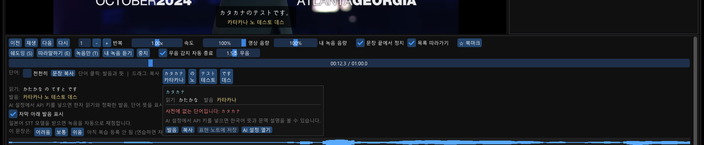

# YouShadow

**한국어** | [English](README.en.md)

유튜브 영상으로 영어 쉐도잉을 연습하는 데스크톱 앱 (C++, Windows / macOS).

링크 하나만 넣으면 영상과 영어 자막을 받아 문장 단위로 나눠 주고, 문장별로 반복 재생 · 쉐도잉 · 따라말하기 녹음을 한 뒤 whisper 음성 인식으로 발음을 채점합니다. 연습 기록은 SQLite에 쌓이고, 간격 반복 방식으로 복습할 문장을 골라 줍니다.


## 화면

| 학습 화면 | 홈 (라이브러리) |
|---|---|
|  |  |




## 기능

- **영상 불러오기**: 유튜브 URL → yt-dlp 로 720p 영상과 영어 자막(json3) 다운로드. 자막이 없거나 유튜브가 자막 요청을 막으면 whisper.cpp 로 대본을 만든다
- **내 영상 파일**: mkv · mp4 · avi · mov · webm 등 PC 에 있는 영상도 [파일 열기] 나 창에 끌어다 놓기로 연다. 같은 폴더의 같은 이름 자막(.smi / .srt / .vtt, `이름.en.srt` 같은 변형 포함) 을 자동으로 읽고, 없으면 영상 안의 영어 자막 트랙을 뽑고, 그것도 없으면 whisper 로 대본을 만든다. SMI 는 CP949 · UTF-8 · UTF-16 을 모두 읽고 여러 언어가 섞여 있으면 영어 클래스를 고른다. 같은 이름의 자막이 여러 개면(.smi 와 .srt 등) 영어가 가장 많은 것을 쓴다. 영상은 복사하지 않고 원본 경로만 기억한다
  - **대사 단위 문장**: 자막 파일은 장면(대사) 하나를 문장 하나로 쓴다. 한 장면에 두 사람 대사(`- Yes. - Thank you.`)가 있으면 나누고, 자막 제작 실수로 붙은 문장 부호 뒤(`year,it's` → `year, it's`)를 띄우고, 제작자 주소 · 기호만 있는 줄은 뺀다
  - **한국어 자막**: SMI 안의 한국어 클래스나 영상 옆의 `이름_k.srt` / `이름.ko.srt` 를 찾아 시간이 겹치는 영어 대사에 붙인다. 영상 자막 아래와 문장 목록에 함께 보이고, [한국어 자막] 체크(단축키 K) 로 끄면 뜻 없이 듣고 따라 하는 연습을 할 수 있다
- **일본어 학습 모드**: 홈 화면에서 학습 언어를 영어 / 일본어 중 고른다. 일본어 영상은 일본어 자막을 받고, 문장을 형태소 단위로 나눠 각 단어 아래에 **한국어 발음**을, 자막 아래에 문장 전체의 발음을 보여 준다 (한자를 못 읽어도 따라 말할 수 있게). 단어를 클릭하면 기본형 · 읽기(히라가나) · 한국어 발음 · 품사 · 영어 뜻이 뜬다
  - **오프라인 사전**: [일본어 사전 받기] 로 약 17MB 팩을 한 번 받으면 단어 분할 · 읽기 · 발음 · 뜻이 모두 AI 없이 나온다. 분할은 MeCab 의 IPADIC 사전과 같은 비터비 탐색을 자체 구현한 것이고(`src/jadict.cpp`), 뜻은 JMdict(일영 사전) 의 영어 풀이다. 조사 は→와, 장음(とうきょう→토쿄) 같은 발음 규칙은 사전의 발음 필드를 따른다
  - AI 는 자동으로 호출되지 않는다. 팝업의 [AI 로 한국어 설명] 을 누를 때만 한 번 호출하고 결과를 저장한다. 사전이 없을 때의 대체로 [이 문장만 AI 로] 버튼도 있다
  - 채점은 whisper 다국어 small 모델(466MB) 로 하되, 원문과 인식 결과를 모두 읽기(히라가나)로 바꿔 비교하므로 한자/가나 표기 차이는 틀린 것으로 잡히지 않는다
  - 발음 소리: 일본어 음성이 있으면 그것으로(Windows 는 설정 > 음성 추가 > 일본어, Mac 은 Kyoko 내장), 없으면 한국어 음성이 한국어 발음 표기를 대신 읽어 준다
  - [읽기·발음 표시] 체크(단축키 P) 를 끄면 단어 아래 발음, 읽기/발음 줄, 자막 아래 발음, 문장 목록의 발음이 모두 숨겨져 직접 읽는 연습을 할 수 있다. 단어를 클릭하면 팝업에서만 확인
- **문장 분할**: 유튜브 자막과 whisper 대본은 단어 타임스탬프를 문장 부호 · 침묵 · 길이 기준으로 나눠 문장 목록을 만든다 (일본어는 。！？ 와 글자 수 기준). 자막 파일은 대사 단위 그대로
- **재생**: libmpv 로 영상 재생. 문장 클릭 재생, 반복, 속도 0.5x~1.5x (피치 유지), 자유 재생 중 현재 문장 하이라이트
- **연습 모드**
  - 쉐도잉: 원본과 동시에 말하기 (영상이 끝나도 말을 마칠 때까지 녹음)
  - 따라말하기: 듣고 → 말하고 → 원본과 내 녹음 이어서 비교
  - 녹음만: 원본 듣기 없이 바로 녹음 (같은 문장 반복 연습)
  - 무음 감지 자동 종료 (배경 소음을 재서 감도 자동 조절), Space 로 수동 종료
- **채점**: 내 녹음을 whisper 로 텍스트화해서 원문과 단어 단위로 정렬. 정확도 % 와 맞음 / 빠짐 / 다르게 들림 / 추가로 들림 표시. 추임새("uh", "um")와 효과음 표기는 제외
- **문장 학습** ([학습] 탭)
  - 리스닝: 자막을 숨긴 채 문장을 듣고 받아쓰기. 대소문자 · 문장 부호는 무시하고 단어 단위로 채점
  - 영작: AI 해설의 한국어 번역만 보고 영어로 써 보기 (번역이 없으면 그 자리에서 생성)
  - 문제 진행 중에는 자막 · 문장 목록 · 단어 발음 · 해설에서 정답이 숨겨지고, 채점 결과는 연습 기록과 통계에 반영
- **AI 표현 해설** (Claude / ChatGPT / Gemini 중 선택, 본인 API 키 사용)
  - 문장마다 한국어 번역, 배울 만한 표현(뜻 · 뉘앙스 · 예문), 문법 포인트를 생성. 앞뒤 문장을 문맥으로 함께 보냄
  - 한 문장씩 또는 영상 전체를 한 번에 생성하고 DB 에 캐시
  - 마음에 드는 표현은 [저장] → 표현 노트에 모이고, 간격 반복으로 복습 세션에 카드로 나온다 (앞면 표현 → 뜻 보기 → 평가)
  - API 키는 Windows 는 DPAPI, macOS 는 Keychain 으로 이 PC 의 사용자 계정만 풀 수 있게 암호화해 저장
- **기록과 복습** (SQLite)
  - 홈: 영상별 진행률, 연습 횟수, 평균 점수, 마지막 연습, 최근 30일 그래프, 연속 학습일
  - 문장별 연습 이력과 예전 녹음 다시 듣기, 북마크
  - 간격 반복: 연습한 문장은 다음 날 복습 목록에 나타나고, 어려움 / 보통 / 쉬움 평가로 다음 복습일이 정해진다 (SM-2 단순화)
  - 복습 세션: [복습 시작] 한 번으로 복습할 문장을 순서대로 열어 준다
- **파형 표시**: 원본 문장과 내 녹음의 파형을 나란히 표시
- **음량**: 영상 음량과 내 녹음 재생 음량을 따로 조절 (설정 기억)
- **단어 발음과 뜻**: 현재 문장이 단어 버튼으로 펼쳐지고, 클릭하면 시스템 음성 합성(영어 음성)이 발음을 읽어 주면서 뜻 팝업이 뜬다. **오프라인 영어 사전**(약 6MB, 팝업의 [영어 사전 받기] 로 한 번)이 있으면 AI 없이 기본형 · 발음 기호 · 품사별 한국어 뜻 · 짧은 영어 정의가 바로 나온다. 변화형(`got` → get 의 과거형, `bucks` → buck 의 복수형)과 축약형(`didn't` → did not)도 원형으로 찾는다. 문맥에 맞는 설명이 필요하면 [AI 로 문맥 설명] 을 눌러 그때만 AI 를 한 번 호출하고, 결과는 저장해 다시 묻지 않는다. 사전이 없으면 온라인 Wiktionary 영어 정의를 보여 준다. 팝업에서 바로 [표현 노트에 저장]. 천천히 듣기 옵션, 표현 탭과 복습 카드에도 [듣기]. 발음은 오프라인, 별도 설치 없음
- **문장 복사**: 단어 버튼 위를 드래그하면 그 범위의 단어가 클립보드에 복사되고, [문장 복사]로 문장 전체도 복사할 수 있다

## 다운로드 (사용자용)

[Releases](https://github.com/JuZeroKR/YouShadow/releases) 에서 받습니다.

| 파일 | 설명 |
|---|---|
| `YouShadow-Setup-v*.exe` | Windows 10/11 64bit 설치 프로그램. 관리자 권한 없이 사용자 폴더에 설치되고 시작 메뉴에 등록됩니다 |
| `YouShadow-v*-win64.zip` | Windows 포터블. 압축을 풀고 `YouShadow.exe` 를 실행합니다 |
| `YouShadow-v*-macos-arm64.zip` | macOS 12+ (Apple Silicon). 압축을 풀고 `YouShadow.app` 을 응용 프로그램 폴더로 옮겨 실행합니다 |

- yt-dlp, ffmpeg, deno 가 동봉되어 있어 따로 설치할 것이 없습니다.
- 발음 채점과 자막 없는 영상의 대본 생성에 쓰는 whisper 모델(148MB)은 앱 상단의 [STT 모델 받기] 버튼으로 받습니다.
- 학습 데이터는 Windows 는 `%LOCALAPPDATA%\YouShadow`, macOS 는 `~/Library/Application Support/YouShadow` 에 저장되며, 프로그램을 제거해도 남습니다.
- 코드 서명이 없어서 처음 실행할 때 경고가 뜰 수 있습니다. Windows 는 SmartScreen 에서 [추가 정보] → [실행], macOS 는 우클릭 → [열기] 로 진행하세요 (막히면 `xattr -dr com.apple.quarantine /Applications/YouShadow.app`).

## 빌드 (개발자용)

### Windows

요구 사항: Windows 10/11, Visual Studio 2022 이상 (MSVC), CMake 3.20+, git

```powershell
# 1. 의존성 받기 (third_party/ 와 models/ 에 설치, 저장소에는 포함되지 않음)
powershell -ExecutionPolicy Bypass -File scripts\setup-deps.ps1

# 2. 빌드 (설치된 최신 Visual Studio 를 자동으로 사용)
cmake -S . -B build -A x64
cmake --build build --config Release

# 3. 실행에 필요한 외부 도구
winget install yt-dlp.yt-dlp     # yt-dlp + ffmpeg 가 PATH 에 들어간다
```

### macOS

요구 사항: macOS 12+, Xcode Command Line Tools, CMake 3.20+, git, [Homebrew](https://brew.sh)

```bash
# 1. 의존성 받기 (third_party/ 와 models/ 에 설치 + brew 로 glfw, mpv, yt-dlp, ffmpeg)
bash scripts/setup-deps.sh

# 2. 빌드
cmake -S . -B build -DCMAKE_BUILD_TYPE=Release
cmake --build build -j

# 3. 실행 (저장소 루트에서)
./build/youshadow-gui
```

플랫폼별 구현: HTTPS 는 WinHTTP ↔ 시스템 libcurl, API 키 암호화는 DPAPI ↔ Keychain(마스터 키) + AES-256, 단어 발음은 SAPI ↔ AVSpeechSynthesizer, 데이터 경로는 `%LOCALAPPDATA%\YouShadow` ↔ `~/Library/Application Support/YouShadow`. 첫 녹음 때 마이크 권한을 요청합니다.

### 공통 의존성

`scripts/setup-deps.ps1` (Windows) / `scripts/setup-deps.sh` (macOS) 가 받는 것:

| 라이브러리 | 용도 |
|---|---|
| [Dear ImGui](https://github.com/ocornut/imgui) + [GLFW](https://www.glfw.org/) | GUI |
| [libmpv](https://mpv.io/) ([zhongfly/mpv-winbuild](https://github.com/zhongfly/mpv-winbuild)) | 영상 재생 (OpenGL 텍스처로 렌더) |
| [whisper.cpp](https://github.com/ggml-org/whisper.cpp) + ggml-base.en 모델 | 음성 인식 (채점, 대본 생성) |
| [miniaudio](https://miniaud.io/) | 마이크 녹음, 녹음 재생 |
| [SQLite](https://www.sqlite.org/) | 학습 기록 |
| [nlohmann/json](https://github.com/nlohmann/json) | 자막 파싱 |

### 배포 패키지 만들기

```powershell
powershell -ExecutionPolicy Bypass -File scripts\package.ps1   # Windows
```
```bash
brew install dylibbundler
bash scripts/package.sh                                        # macOS
```

`dist/` 에 만들어집니다 — Windows 는 포터블 zip 과 Inno Setup 설치 프로그램, macOS 는 `YouShadow.app` 과 zip (libmpv 등 의존 dylib 을 앱에 동봉하고 ad-hoc 서명). 둘 다 yt-dlp, ffmpeg, deno 를 내려받아 동봉합니다. `v*` 태그를 push 하면 GitHub Actions 가 두 플랫폼 모두 빌드해서 Release 에 올립니다.

## 실행

```
run-gui.cmd                                              # Windows
run-gui.cmd https://www.youtube.com/watch?v=VIDEO_ID

./build/youshadow-gui                                    # macOS
./build/youshadow-gui https://www.youtube.com/watch?v=VIDEO_ID
```

실행하면 홈 화면이 뜹니다. 상단 입력창에 URL 을 넣고 [불러오기]를 누르면 다운로드 후 학습 화면으로 넘어갑니다. 처음 한 번만 받고 그 뒤로는 캐시를 씁니다.

일본어를 공부하려면 홈 화면 상단의 "학습 언어" 에서 일본어를 고른 뒤 영상을 불러오세요. 영상마다 언어가 기억되므로 영어 영상과 일본어 영상을 섞어 둘 수 있습니다. 일본어 단어 발음은 Windows 설정 > 시간 및 언어 > 음성 > 음성 추가에서 일본어를 설치해야 나옵니다.

내 PC 의 영상은 [파일 열기] 로 고르거나 영상 파일(자막 파일과 함께여도 됨) 을 창에 끌어다 놓으면 됩니다. 입력창에 파일 경로를 붙여 넣어도 됩니다. 영상과 같은 이름의 .smi/.srt/.vtt 가 같은 폴더에 있으면 자동으로 읽습니다. 자막 파일만 끌어다 놓으면 열려 있는 영상의 자막을 바꿉니다 (학습 기록이 아직 없는 영상만).

저장소 루트에서 실행하면(개발 모드) `data/`, `models/` 를 쓰고, 그 외에는 Windows 는 `%LOCALAPPDATA%\YouShadow`, macOS 는 `~/Library/Application Support/YouShadow` 를 씁니다. 외부 도구 출력은 그 아래 `logs/tools.log` 에 남습니다.

### 단축키

| 키 | 동작 |
|---|---|
| Space | 재생 / 일시정지, 녹음 중이면 녹음 끝내기 |
| ← / → | 이전 / 다음 문장 |
| R | 현재 문장 다시 |
| S | 쉐도잉 |
| E | 따라말하기 |
| T | 녹음만 |
| B | 북마크 |

### AI 표현 해설 설정

상단 [AI 설정]에서 Claude(Anthropic) / ChatGPT(OpenAI) / Gemini(Google) 중 하나를 고르고 API 키를 넣습니다. [모델 목록]으로 사용 가능한 모델을 받아 고를 수 있고 [연결 테스트]로 확인합니다.

- 키 발급: console.anthropic.com / platform.openai.com / aistudio.google.com
- 비용은 각 서비스에 본인 계정으로 청구됩니다. 문장 하나에 입력·출력 합쳐 수백 토큰 수준입니다.
- 학습 화면 오른쪽 [표현] 탭에서 [이 문장 해설] 또는 [모든 문장 해설]. 결과는 캐시되어 다시 요청하지 않습니다. 표현 옆 [저장]을 누르면 [표현 노트]에 모이고 복습 세션에 카드로 나옵니다.

### 데이터 위치

```
data/
  youshadow.db               SQLite (영상, 문장, 연습 이력+점수, 복습 상태, 북마크)
  <VIDEO_ID>/
    video.mp4, audio.wav      원본 영상, 오디오 (mono 16kHz)
    video.en.json3            유튜브 자막
    segments.json             문장 분할 결과 (고정)
    rec/                      내 녹음 (wav)
models/ggml-base.en.bin      whisper 모델 (148MB)
```

`data/`, `models/`, `third_party/`, `build/`, `dist/` 는 저장소에 올라가지 않습니다.

## 구조

```
src/
  gui_main.cpp    ImGui 앱: 레이아웃, 연습 모드 상태 머신, 홈/복습 세션, 백그라운드 작업
  player.cpp      libmpv → OpenGL FBO 텍스처
  youtube.cpp     URL 파싱, yt-dlp / ffmpeg 호출
  lang.cpp        학습 언어(영어/일본어), 일본어 보조 (간이 토큰화, 가나 → 한국어 발음)
  jadict.cpp      일본어 오프라인 사전: IPADIC 격자 + 비터비 형태소 분할, 읽기/발음, JMdict 영어 뜻
  endict.cpp      영어 오프라인 사전: 표제어 · 변화형 표 · 규칙 변화로 원형 찾기, 품사별 한국어 뜻
  tools/ja_dict_build.cpp  mecab-ipadic + JMdict_e → ipadic.bin / jmdict.bin 팩 생성 (개발용)
  tools/en_dict_build.py   kaikki.org 위키낱말사전 추출 데이터 → en-dict.tsv 팩 생성 (개발용)
  transcript.cpp  단어 목록 → 문장 세그먼트, json3 자막 파싱
  subtitle.cpp    SMI / SRT / VTT 자막 파일 → 대사 단위 문장 (인코딩 감지, 언어 클래스 선택, 한국어 자막 맞추기)
  local.cpp       내 영상 파일 등록 (ID, 자막 찾기, 내장 자막 추출, 오디오 추출)
  stt.cpp         whisper.cpp 래퍼 (단어 타임스탬프 / 텍스트)
  scoring.cpp     원문 vs 인식 결과 편집 거리 정렬, 정확도
  audio.cpp       miniaudio 녹음/재생, 파형 피크, 리샘플
  db.cpp          SQLite 저장소, 간격 반복, 통계, 설정, 해설 캐시, 표현 카드
  llm.cpp         Claude / OpenAI / Gemini REST 호출, 문장 해설 프롬프트
  http.cpp        HTTPS 클라이언트 (Windows: WinHTTP, macOS: libcurl)
  secret.cpp      API 키 암호화 (Windows: DPAPI, macOS: Keychain + AES)
  tts.cpp/.mm     단어 발음 (Windows: SAPI, macOS: AVSpeechSynthesizer)
  paths.cpp       데이터/모델 경로, 동봉 도구 PATH, 숨김 프로세스 실행
  main.cpp        CLI 버전 (초기 프로토타입)
  stt_test.cpp    STT + 채점 검증 도구
scripts/setup-deps.ps1 · .sh   의존성 설치 (Windows · macOS)
scripts/package.ps1 · .sh      배포 패키지 (Windows · macOS)
installer/youshadow.iss  Inno Setup 스크립트
.github/workflows/release.yml  태그 push 시 자동 빌드 · Release
```

테스트용으로 `youshadow-gui.exe --script cmds.txt` 를 주면 `load <id>` / `wait <초>` / `play <n>` / `echo <n>` / `record` / `home` / `review` / `rate hard|good|easy` / `explain` / `explain_all` / `settings` / `tab <name>` / `quit` 명령을 순서대로 실행합니다. 시연 GIF 도 이 방식으로 찍었습니다. `llm_test.exe <claude|openai|gemini> <API키>` 는 문장 해설 한 번을 콘솔에서 시험합니다.

## 알아 둘 것

- 유튜브가 자막 요청을 일시적으로 막는 경우(HTTP 429)가 있습니다. 그때는 whisper 로 대본을 만들며, 몇 시간 뒤 다시 불러오면 자막을 받습니다.
- 채점은 CPU 에서 whisper base.en 모델로 돌립니다. 10초 녹음에 약 0.4초 걸립니다.
- 개인 학습 용도로 만든 프로그램입니다. 영상 다운로드는 유튜브 약관을 확인하고 본인 책임으로 사용하세요.

## AI 사용 표기

이 프로젝트의 설계와 코드는 Anthropic 의 **Claude (Claude Code)** 와 대화하며 작성했습니다. 아키텍처 제안, 코드 작성, 디버깅, 문서 작성에 AI 를 사용했고, 기능 방향 결정과 실제 사용 테스트는 사람이 했습니다.

## 다음 단계 후보

- 문장 편집 (분할 / 병합)
- 더 큰 whisper 모델 선택 (small.en), GPU 가속
- 억양 · 속도 비교, 음소 단위 발음 피드백

## 사전 데이터 출처

일본어 모드의 오프라인 사전 팩(GitHub 릴리스 `ja-dict-v1`) 은 다음 데이터를 변환한 것입니다. 팩 안에 라이선스 전문이 들어 있습니다.

- **mecab-ipadic 2.7.0** (나라첨단과학기술대학원대학 IPADIC 라이선스) — 형태소 분할과 읽기
- **JMdict** (Electronic Dictionary Research and Development Group, CC BY-SA 4.0) — 영어 뜻과 품사

영어 오프라인 사전 팩(GitHub 릴리스 `en-dict-v1`) 은 위키낱말사전(Wiktionary 영어판 · 한국어판, CC BY-SA 4.0) 을 [kaikki.org](https://kaikki.org) (Wiktextract, Tatu Ylonen) 의 추출 데이터에서 가공한 것입니다. `python tools/en_dict_build.py <ko-extract.jsonl.gz> <kaikki.org-dictionary-English.jsonl.gz> models/en-dict` 로 다시 만들 수 있습니다.

## 라이선스

[MIT](LICENSE). 시연에 쓰인 영상은 TED 의 "Why Social Health Is Key to Happiness and Longevity | Kasley Killam" 이며 저작권은 TED 에 있습니다.
